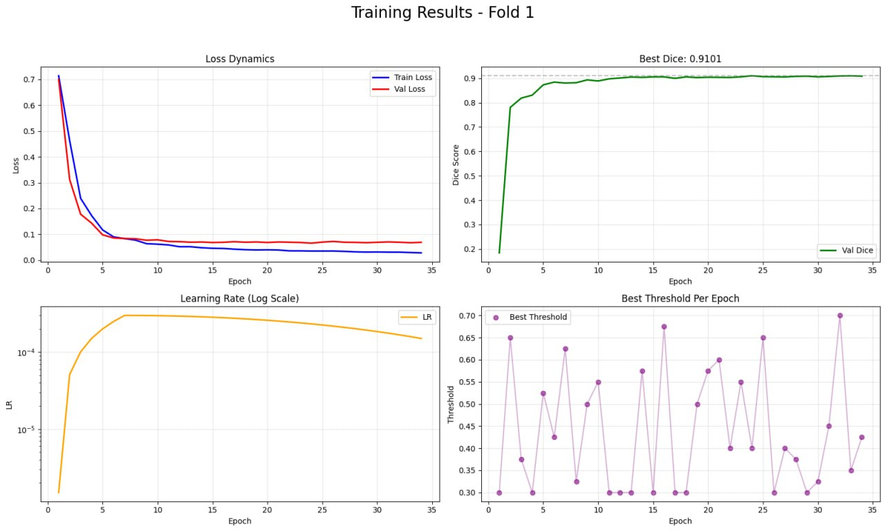

# UNet++ с EfficientNet-B3 — Обучение модели сегментации

## Обзор

Jupyter-ноутбук `UNETPlusPLus_b3.ipynb` реализует полный цикл обучения и инференса для **бинарной сегментации изображений** на основе архитектуры **UNet++** с энкодером **timm-efficientnet-b3** (предобучен на весах noisy-student).

Ноутбук предназначен для Google Colab с поддержкой GPU и включает:

- **5-кратную стратифицированную кросс-валидацию** (Stratified K-Fold)
- **Двухфазное обучение** (замороженный энкодер → полная дообучение)
- **Расширенные аугментации данных**
- **Ансамблевый инференс с Test-Time Augmentation (TTA)**

---

## Архитектура

| Компонент | Значение |
|-----------|----------|
| **Архитектура** | UNetPlusPlus (UNet++) |
| **Энкодер** | timm-efficientnet-b3 |
| **Веса энкодера** | noisy-student |
| **Attention в декодере** | SCSE (Spatial & Channel Squeeze-and-Excitation) |
| **Размер входа** | 384×384 |
| **Выход** | Бинарная маска (1 канал) |

---

## Ключевые особенности

### Обучение

1. **Стратифицированное разбиение** — `StratifiedKFold` (5 сплитов) с группировкой по IP платформы
2. **Двухфазное обучение**:
   - **Фаза 1 (3 эпохи):** Энкодер заморожен, обучается только декодер
   - **Фаза 2 (57 эпох):** Полное дообучение всей модели
3. **Планировщик скорости обучения**:
   - **Warmup:** Линейный warmup на 6 эпох (start_factor=0.005)
   - **Cosine Annealing:** LR убывает с 7-й по 60-ю эпоху (eta_min=1e-6)
4. **Ранняя остановка:** Patience = 10 эпох по метрике Dice



### Функция потерь

**ComboLoss** — взвешенная комбинация BCE и Dice Loss:
```
Loss = 0.4 * BCEWithLogitsLoss + 0.6 * DiceLoss
```

### Аугментации данных

Трансформации для обучения:
- Resize до 384×384
- Сдвиг, масштаб, поворот (малые углы: shift=0.01, scale=0.05, rotate=5°)
- Горизонтальный флип (p=0.5)
- Случайная яркость и контраст (p=0.5)
- Тон, насыщенность, значение (p=0.5)
- Размытие (p=0.1)
- Shot Noise (p=0.1)
- Coarse Dropout (p=0.1)

Валидация — только Resize.

### Датасет

- **Изображения:** Поддерживаемые форматы `.jpg`, `.jpeg`, `.png`, `.webp`
- **Маски:** `.png` (бинарные, порог = 0)
- **Сопоставление:** Изображения и маски связываются по имени файла (stem)
- **Группировка по платформам:** IP извлекается из имени файла для стратификации

---

## Конфигурация

```python
IMG_SIZE = 384
BATCH_SIZE = 12
NUM_EPOCHS = 60
EARLY_STOPPING_CONST = 10
WARMUP_EPOCHS = 6
FROZEN_EPOCH = 3
LR = 3e-4
WEIGHT_DECAY = 5e-4
N_SPLITS = 5
TRAIN_FOLDS = [1, 2, 3, 4, 5]
NUM_WORKERS = 1
SEED = 42
```

---

## Инференс

### Ансамблевое предсказание

- Загружаются все 5 чекпоинтов (по одному на фолд)
- Каждая модель использует свою функцию предобработки и порог
- **Test-Time Augmentation (TTA):** Усреднение с горизонтальным флипом
- **Агрегация:** Вычитание порога каждой модели, усреднение по ансамблю
- Финальная маска: `(ensemble_probs > 0.0)`

---

## Выходные файлы

После обучения в папку `./seg_train_runs/` сохраняются:

| Файл | Описание |
|------|----------|
| `best_model_fold_{1-5}.pth` | Лучший чекпоинт по фолду (state dict, порог, конфиг) |
| `fold_{1-5}_history.png` | Графики обучения (Loss, Dice, LR, Threshold) |
| `history_fold_{1-5}.csv` | История обучения по эпохам |

---

## Зависимости

```bash
pip install segmentation_models_pytorch
pip install albumentations
```

Дополнительно: `torch`, `torchvision`, `opencv-python`, `numpy`, `pandas`, `scikit-learn`, `matplotlib`, `tqdm`

---

## Использование

### Обучение
1. Загрузите датасет в Google Drive (`ML/lab3ImageSegmentation/`)
2. Обновите путь `DATA_ROOT` в ячейке конфигурации
3. Запустите все ячейки от `# LOAD DATA` до `main()`
4. Чекпоинты и графики сохранятся автоматически

### Инференс
1. Обновите пути `TEST_IMAGES_DIR` и `CHECKPOINTS_DIR`
2. Убедитесь, что все 5 чекпоинтов находятся в `CHECKPOINTS_DIR`
3. Запустите ячейки инференса — на выходе получится `submission.csv`

---
